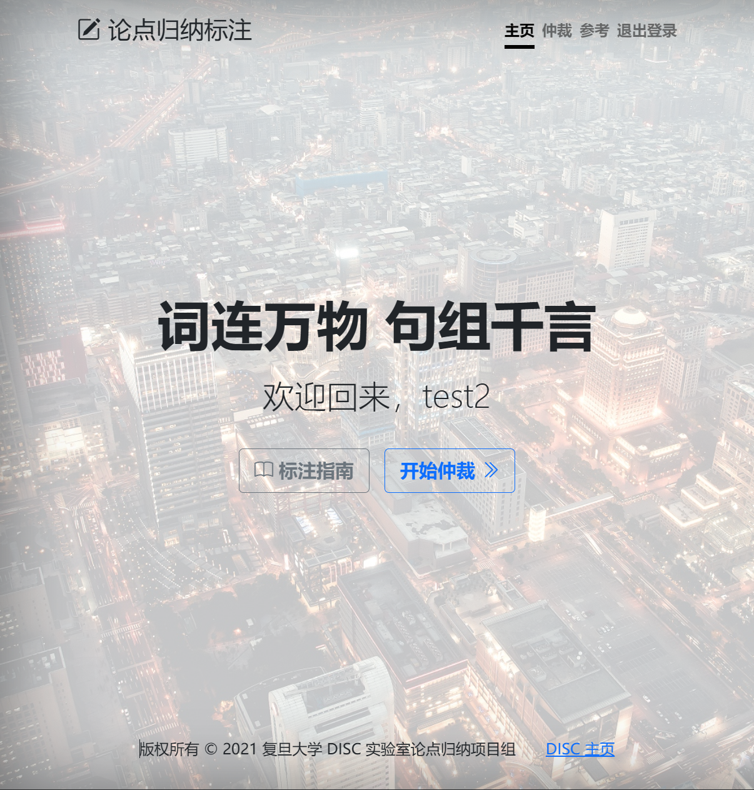
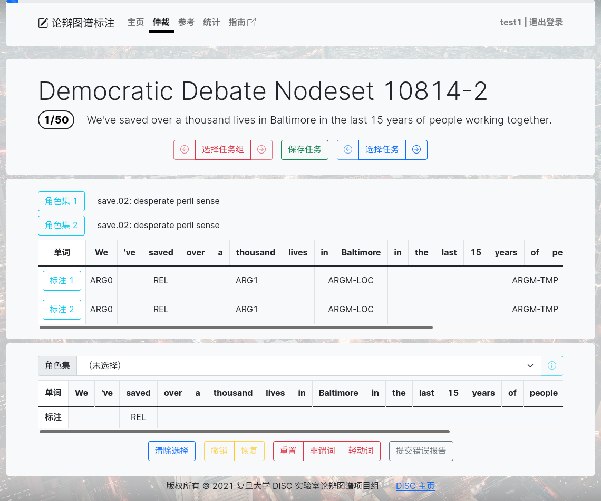

# 仲裁任务

与标注任务不同，仲裁任务需要在两份先前的标注之间，选择合适的标注，并在必要的时候调整结果。仲裁的本质在前两份标注的基础上提供第三份标注，确定最终的结果，因此仍大体遵循常规标注任务的逻辑、流程与规范。下面会重点讨论仲裁任务与标注任务在流程和操作上的差异。

## 仲裁流程

与普通的标注任务一样，仲裁任务也需要选择谓词和角色集，并标注相应的参数。不过在仲裁任务中可以参考任务提供的两个标注版本，它们分别提供了角色集和参数标注的两种选择。

完成仲裁任务的第一步是检查两份标注之间是否存在差异：如果二者有相同的角色集或参数标注，那么它们通常对应正确的标注结果（当然也可以多检查一遍）；但如果两份标注选择了不同的角色集，或者参数标注有差别，就需要仔细核对，选出更符合标注逻辑与要求的角色集或参数标注。

角色集与参数标注可以分别从两份参考标注中挑选，作为最终标注结果的一部分；即使两份标注是一致的，也需要将它们填充到最终的标注中。但是，如果两份标注都存在不符合标注规则的地方，就需要进行微调。微调的过程与常规标注完全一致，可以手动选择角色集并修改参数标注。最后的标注结果以微调后的为准，因此请务必参考指南要求，提交最准确的标注。

## 网站操作

当用户参与仲裁任务时，网站与标注相关的文字会替换为“仲裁”，以示区别。可以据此判断目前进行的任务类型。

仲裁任务的界面与常规标注基本相同，只是在任务框与标注框之间插入了参考标注。

可以点击参考标注的角色集与参数标注左侧的按钮，快捷选择该标注的角色集或参数标注。如果当前标注与参考标注有相同的角色集或参数标注，则按钮会通过反色表示。标注框部分与常规标注一致，可以对最终的仲裁结果进行调整。

*注：任务的初始状态与常规标注一致（角色集未选择、参数仅标注 REL），因此请务必手动选择每个任务的角色集与参数标注。网站也会根据任务选择的角色集统计任务完成的进度。*
