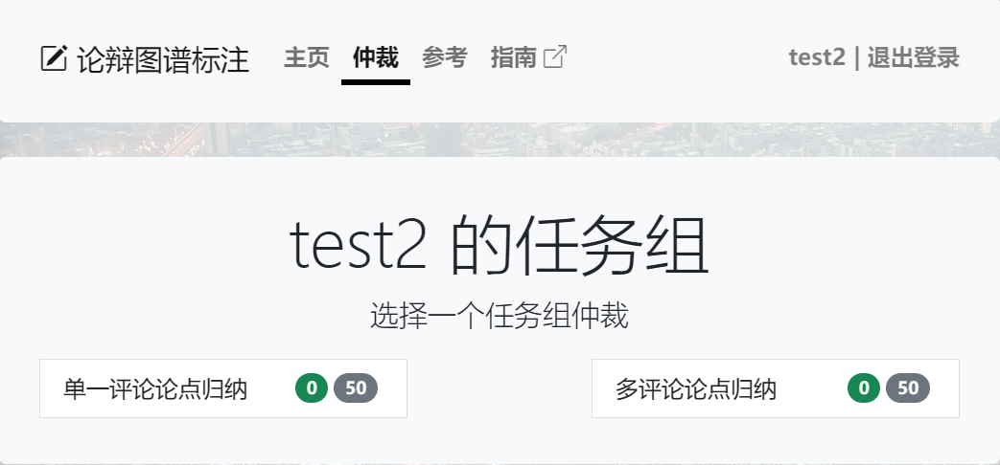
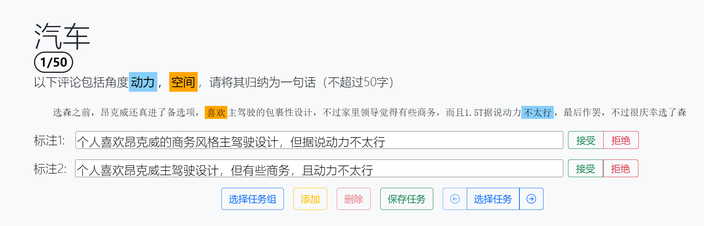
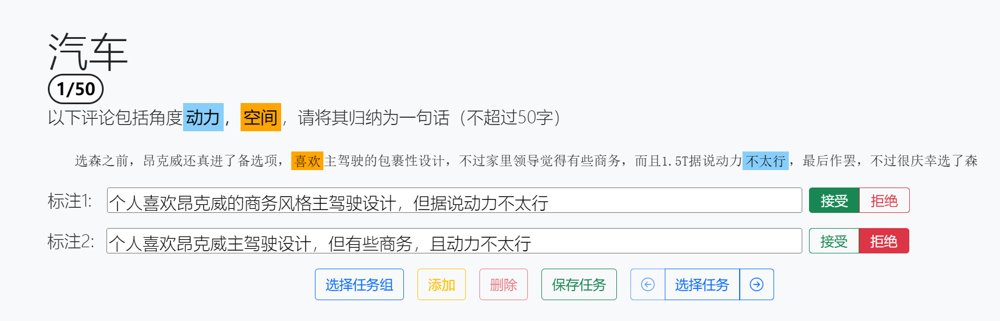
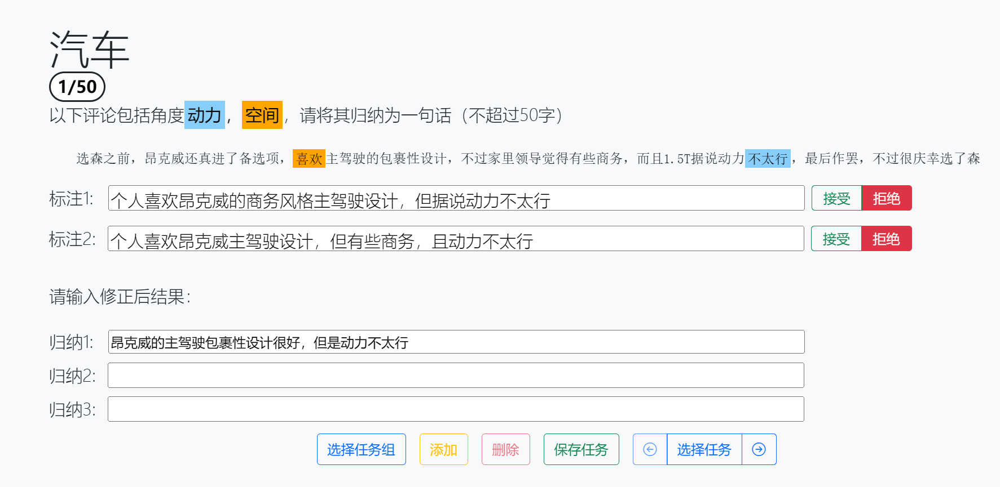

# 仲裁任务

仲裁任务需要对先前的标注进行判断，接受合适的标注并拒绝不合适的标注，在必要的时候需要输入新结果。仲裁任务仍大体遵循常规标注任务的逻辑、流程与规范。下面会重点讨论仲裁任务与标注任务在流程和操作上的差异。

## 仲裁流程

用户在认证为仲裁员后，登录网站，进入到选择任务组页面：

点击任一任务组后进入仲裁页面：

进入仲裁页面后，用户会得到一个或多个评论以及对应的归纳标注。用户需要根据评论，判断每个归纳标注是否合理，若合理，则点击该标注右端的接受按钮；否则点击拒绝按钮。

若用户拒绝了全部的归纳标注，则需要输入新的标注并进行保存：

