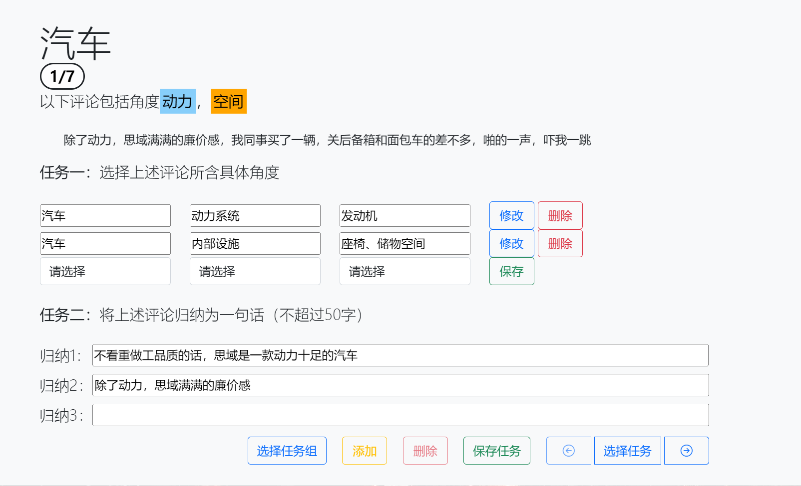
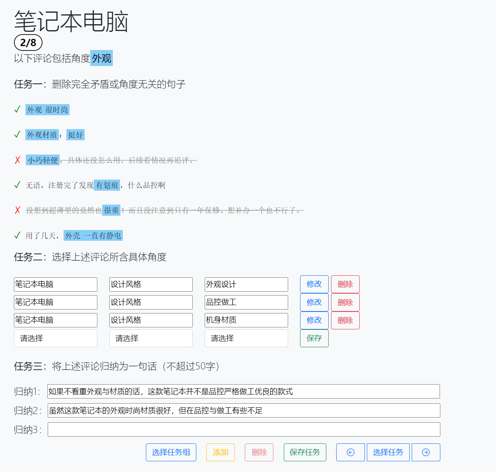
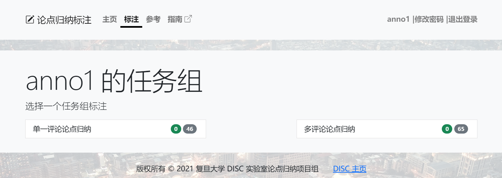

# 标注任务

论点归纳标注任务指将给定的一个或多个评论从特定角度归纳为一句话。标注者需登录标注网页方可进行标注。本项目将标注任务分为两种模式：单一评论论点归纳和多评论论点归纳。

## 模式一：单一评论论点归纳

在该任务模式下，用户会得到一条评论以及该评论所涉及的若干个角度。该评论在这些角度上的情感极性不一致，即评论可能在其中一个角度上是正向表述，而在另一个角度上是负面表述。用户需要选择该评论所包含的细分角度，并将该评论从给定角度进行归纳，将情感极性冲突的表述归纳为自洽的简短论点。

### 任务一：选择细分角度

用户首先需要选择所给评论所包含的细分角度，具体细分角度如下：

* 汽车
    - 车型分类
        + 轿车
        + SUV
        + 跑车
    - 车身尺寸
        + 车长、车宽、车高
        + 轴距、离地间隙
        + 车重、载重量
    - 动力系统
        + 发动机
        + 变速箱
        + 驱动方式
    - 行驶性能
        + 最高车速、加速性能
        + 制动性能
        + 转向性能
        + 悬挂性能
        + 燃油经济性、续航里程
    - 安全性能
        + 安全气囊、安全带
        + 盲区监测系统、倒车影像
        + 自动泊车、自适应巡航
        + 刹车
    - 内部设施
        + 空调、音响系统
        + 导航、多媒体系统
        + 座椅、储物空间
    - 外观设计
        + 车身线条、造型风格
        + 前脸、车灯、轮毂
    - 品牌声誉
        + 品牌影响力
        + 售后服务、维修保养
        + 品牌认知度、口碑
* 化妆品
    - 化妆品分类
        + 护肤品
        + 彩妆品
        + 美发用品
        + 身体护理品
    - 适合人群
        + 男性、女性、中性
        + 年龄
        + 肤质
    - 功能特点
        + 护肤品：保湿、美白、祛斑、抗皱、去角质、紧致
        + 彩妆品：粉底液、遮瑕膏、唇膏、眼影、睫毛膏、腮红
        + 美发用品：洗发水、护发素、染发剂、定型产品
        + 身体护理品：香皂、沐浴露、润肤霜、除臭剂
    - 成分特点
        + 吸收性
        + 天然成分、有机成分
        + 气味
    - 使用方法
        + 涂抹
        + 喷洒
        + 擦拭
        + 按摩
    - 包装&质量
        + 份量、尺寸
        + 外观
        + 方便、便携性
        + 包装是否损坏
    - 品牌&价格
        + 品牌知名度、口碑
        + 价格
        + 性价比
    - 客服服务
        + 服务态度、服务速度
        + 是否虚假宣传
* 笔记本电脑
    - 品牌&价格
        + 品牌知名度、口碑
        + 价格
        + 性价比
    - 电脑型号
        + 超极本
        + 游戏本
        + 商务本
        + 轻薄本
    - 电脑配置
        + 处理器
        + 内存
        + 硬盘
        + 显卡
    - 屏幕特点
        + 尺寸
        + 分辨率
        + 色彩表现
    - 电池续航
        + 续航时间
        + 充电时间
    - 设计风格
        + 机身材质
        + 外观设计
        + 散热
        + 质量
    - 操作系统
        + Windows
        + MacOS
        + Linux
    - 电脑性能
        + 运行速度
        + 启动速度
        + 软件兼容性
        + 噪音
    - 网络特点
        + 无线网络
        + 蓝牙
        + 4G
        + 蜂窝网络
* 餐厅
    - 餐厅类型
        + 中餐厅
        + 外国餐厅
        + 快餐
        + 甜品店
        + 咖啡厅、酒吧
    - 餐厅环境
        + 装修风格
        + 音乐氛围
        + 灯光布局
        + 桌椅设计
        + 温度
        + 带有露台、私人包厢、观景位
    - 餐厅位置
        + 市中心
        + 商业区
        + 居民区
        + 景区
        + 客流量
    - 食材&外观
        + 新鲜度
        + 菜品外观
        + 份量
    - 菜品口感
        + 酸甜苦辣咸
        + 油腻度、爽口度
        + 口感细腻或粗糙
        + 咀嚼度
    - 服务&排队
        + 服务态度、服务速度、服务技能
        + 特色服务、服务项目
        + 排队时间
    - 价格水平
        + 餐厅档次
        + 地段
        + 口味
        + 服务
        + 优惠活动
        + 性价比
    - 卫生程度
        + 餐具清洁
        + 环境卫生
        + 气味
        
*注：若评论所包含角度不在上述细分角度中，可选择相近的二级角度，并在三级角度选择“其他”，手动输入角度。*

### 任务二：冲突论据归纳

完成细分角度选择后，用户可聚焦于所选的角度进行冲突论据的归纳，归纳结果可参考标注网站中“参考”页面所给的归纳范例。

## 模式二：多评论论点归纳

在该任务模式下，用户会得到一个角度以及包含该角度的多个评论，这些评论在该角度的情感极性不一致，即某一评论在该角度上是正向表述，而另一评论在该角度上是负向表述。用户需要将多个评论从所给角度进行归纳，将情感极性冲突的表述归纳为自洽的简短论点。

### 任务一：评论筛选

由于所给的多条评论是由抽样得到的，因此可能出现部分评论完全矛盾或与其他评论不相关的情况，因此首先需要将无效评论删除。用户可点击无效评论前的勾选符号✔使其变为叉号❌，从而删除该条评论。

### 任务二：选择细分角度

[同模式一-任务一](###任务一：选择细分角度)

### 任务三：冲突论据归纳

[同模式一-任务二](###任务二：冲突论据归纳)

## 标注流程

用户在登陆后，进入标注组选择页面：

选择任一任务组进入到标注页面：

 将该评论进行归纳，填入到评论下方的输入框中：

完成后点击“保存任务”按钮完成保存，该标注任务完成。

## 错误报告

若发现存在以下情形，请通过标注页面的错误提交功能反馈相关问题：

- 评论中角度不存在
- 多评论对象不一致
- 矛盾论点无法归纳
- 其它标注问题

报告错误时，请首先选择错误分类，再详细描述错误原因，方便后续分析与处理。
