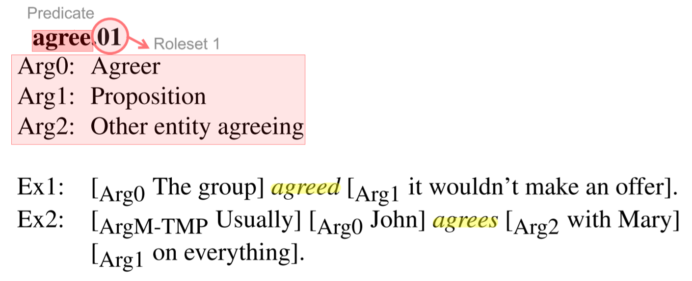

# 标注流程

论点归纳标注任务指将给定的一个或多个评论从特定角度归纳为一句话。标注者需注册登录标注网页方可进行标注。本项目将标注任务分为两种模式：单一评论论点归纳和多评论论点归纳。

## 单一评论论点归纳

在该任务模式下，用户会得到一条评论以及该评论所涉及的若干个角度。该评论在这些角度上的情感极性不一致，即评论可能在其中一个角度上是正向表述，而在另一个角度上是负面表述。用户需要将该评论从给定角度进行归纳，将情感极性冲突的表述归纳为自洽的简短论点。

## 多评论论点归纳

在该任务模式下，用户会得到一个角度以及仅包含该角度的多个评论，这些评论在该角度的情感极性不一致，即某一评论在该角度上是正向表述而另一评论在该角度上是负向表述。用户需要将多个评论从所给角度进行归纳，将情感极性冲突的表述归纳为自洽的简短论点。

## 错误报告

若发现存在以下情形，请通过标注页面的错误提交功能反馈相关问题：

- 评论中角度不存在
- 多评论对象不一致
- 完全冲突无法归纳
- 其它标注问题

报告错误时，请首先选择错误分类，再详细描述错误原因，方便后续分析与处理。
