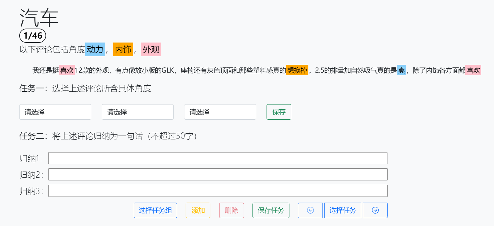
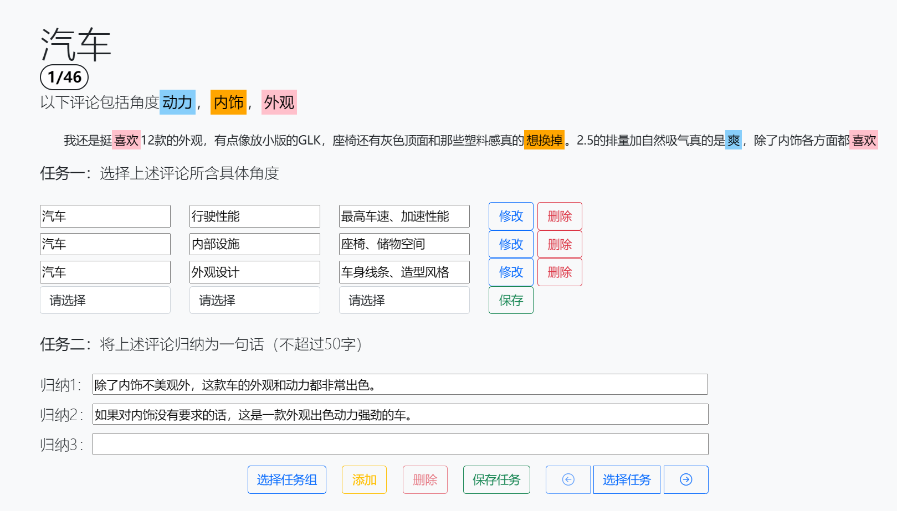
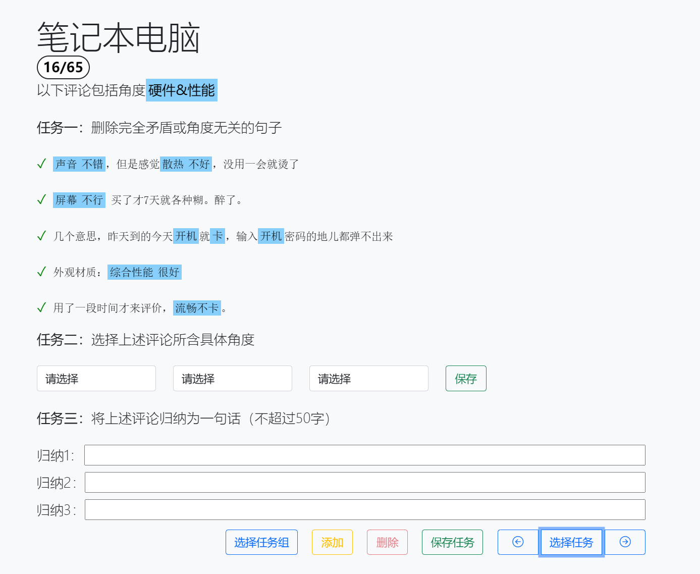
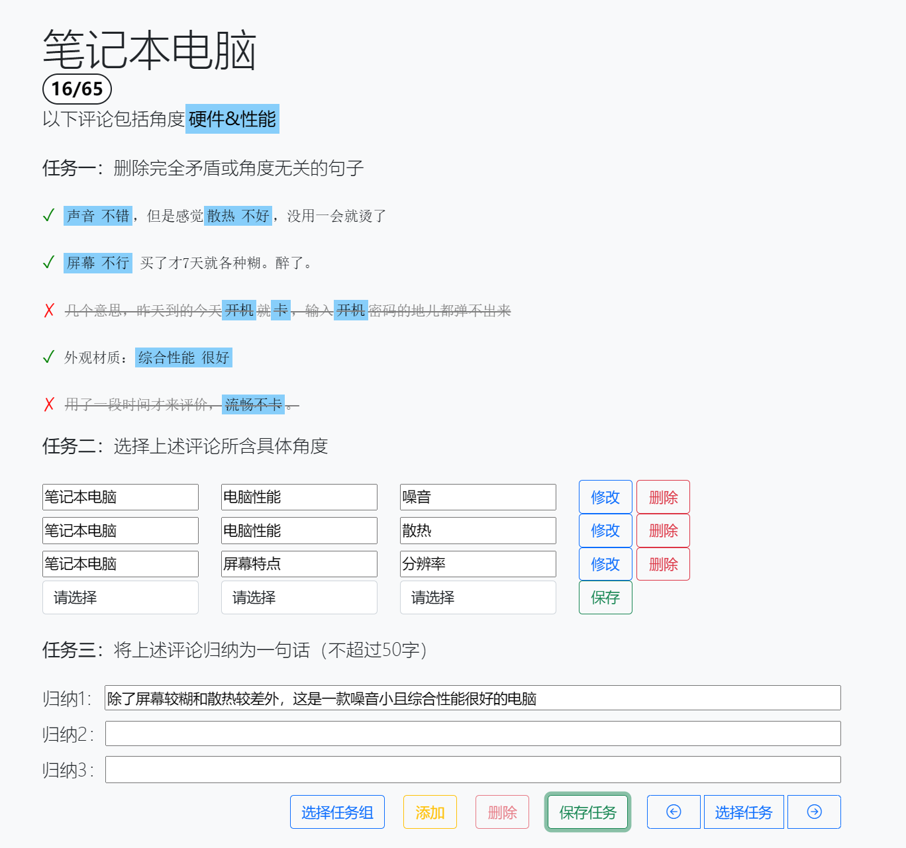

# 标注网站

标注网站的网址为 <http://47.113.193.232:5000/>，请使用分配的帐号和密码登录并完成标注任务。

## 主页与登录

标注网站主页各部分功能如下图所示。用户未登录时主页显示界面如左图，可以点击导航栏上的“登录”按钮进入登录页面，输入用户名和密码登录标注网站。登录后主页变为右图，用户可以点击“开始标注”按钮或导航栏上的“标注”按钮，开始标注任务。点击“标注指南”会打开一个新标签并跳转到本指南的首页。在任何界面点击导航栏上的“参考”按钮可以查看试标注任务的参考结果。

&emsp;&emsp;

## 任务组

点击“开始标注”后，网页将跳转到任务组选择界面，如下图所示。其中，每个任务组会显示其名称与标注状态：绿色表示完成标注的任务数，灰色表示未标注的任务数。

*注：一个任务“完成”当且仅当用户对该任务得到了一个或多个归纳并保存。*

点击选择一个任务组，即可进入对应任务组的标注页面，并自动跳转至上次离开该任务组时正在标注的任务（新用户或网站更新后第一次访问会跳转至第一个任务）。点击导航栏上的“指南”按钮同样可以在新标签打开本指南。

## 标注界面

*注意：标注过程中请务必保持网络连接畅通，否则当前任务的未保存修改可能会丢失；如果网页显示不正常，请检查并尝试关闭 VPN。*

### 模式一：单一评论论点归纳

单一评论论点归纳模式下标注界面如下图所示：

1. 角度选择：
	- 保存：保存当前所选角度
	- 修改：对已保存的角度进行修改
	- 删除：删除对应的角度
	
2. 归纳输入：
	- 选择任务组：点击后返回任务组选择界面，与点击导航栏上的“标注”按钮效果相同。
	- 添加/删除：点击后添加/删除归纳区域的输入框，最少为3条，最多为6条。
	- 保存任务：点击后保存当前标注。每一次标注操作都会自动保存当前标注结果，同时每次回到标注页面都会重新加载标注。
	- 选择任务：点击后出现任务选择列表，点击任务进行跳转。同时可以点击左/右箭头可直接跳转到前/后一条任务。切换任务时，网页将自动保存当前任务的标注结果。

任务列表的每个条目显示了任务的实体类型和标注状态，如下图所示。其中，绿色表示任务已完成标注，如图中前三个任务；黄色表示任务部分完成并已保存，如图中第四个到第七个；如灰色表示任务尚未标注，如图中第七个任务之后的所有任务。

	

完成当前任务标注后的标注界面如下图所示：

### 模式二：多评论论点归纳

多评论论点归纳模式下标注界面如下图所示：

1. 评论筛选
	- 点击评论前方的✔或❌，决定是否删除某一条评论。由于所给的多条评论是由抽样得到的，可能出现部分评论完全矛盾或与其他评论不相关的情况，因此需要将无效评论删除。

2. 角度选择（同模式一）

3. 归纳输入（同模式一）

完成当前任务标注后的标注界面如下图所示：

请尽量确保在任务截止时，任务组中所有任务均显示为绿色。如果存在无法标注的情况，请提交错误反馈。

### 错误反馈：

标注页面下方的“提交错误报告”按钮可供填写并提交错误报告，点击会弹出相应界面，如下图所示。请选择合适的错误原因，并详细填写错误信息，点击“提交”即可提交错误反馈报告。

