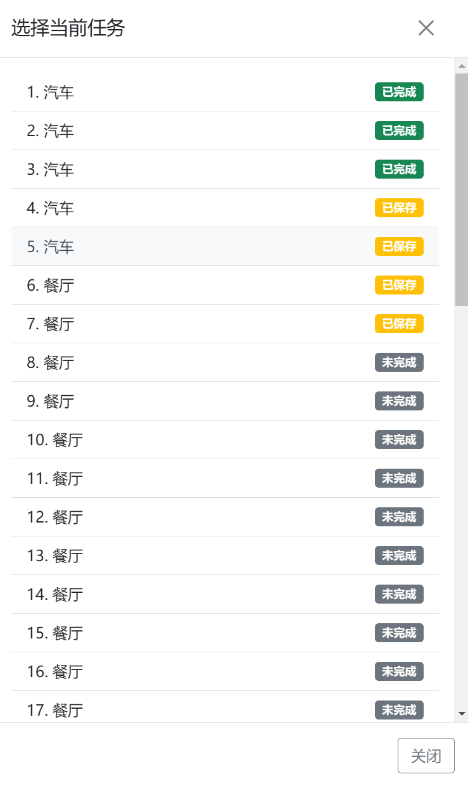
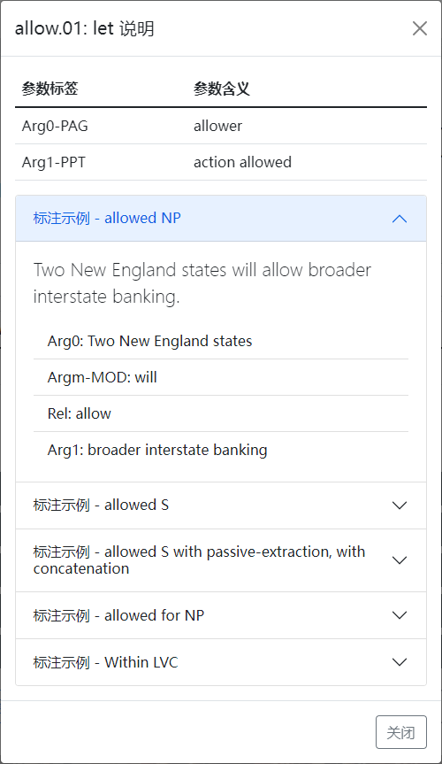
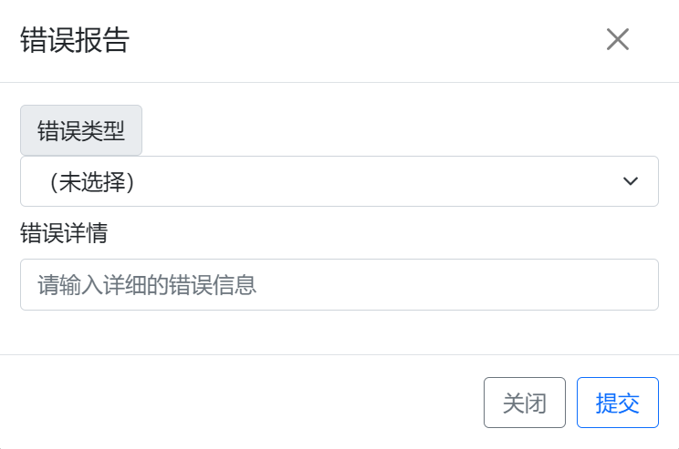

# 标注网站

标注网站的网址为 <http://1.14.162.16:5000>，请使用分配的帐号和密码登录并完成标注任务。

## 主页与登录

标注网站主页各部分功能如下图所示。用户未登录时主页显示界面如左图，可以点击导航栏上的“登录”按钮进入登录页面，输入用户名和密码登录标注网站。登录后主页变为右图，用户可以点击“开始标注”按钮或导航栏上的“标注”按钮，开始标注任务。点击“标注指南”会打开一个新标签并跳转到本指南的首页。

在任何界面点击导航栏上的“参考”按钮可以查看两次试标注任务的参考结果，其中黄色高亮部分表示用户标注与参考标注的差异；点击“统计”按钮可以查看当前分配任务的标注进度（详情见[标注统计](#_5)）。

## 任务组

点击“开始标注”后，网页将展示您的账号所分配到的任务组，如下图所示。其中，每个任务组会显示其名称与标注状态：绿色表示完成标注的任务数，黄色表示标注为 Unknown Roleset 的任务数，灰色表示未标注的任务数（详情见[任务跳转](#_10)）。可以在左侧选择任务组的排序方式，并选择只显示未完成的任务组；单击左侧的“刷新”按钮会更新任务组列表和各个任务的标注状态。

*注：一个任务“完成”当且仅当其角色集已选且不是 Unknown Roleset，因此如果确实存在无法选择角色集的任务，则网站将无法识别该任务及其所在的任务组为“完成”状态，但实际统计时会予以区分。*

点击选择一个任务组，即可进入对应任务组的标注页面，并自动跳转至上次离开该任务组时正在标注的任务（新用户或网站更新后第一次访问会跳转至第一个任务）。点击导航栏上的“指南”按钮同样可以在新标签打开本指南。

## 标注界面

标注界面各个组件的意义与功能如下图所示，详情见[操作流程](#_6)：

完成当前任务标注后的标注界面如下图所示，注意角色集和参数均已标注完毕。

## 标注统计

标注统计界面展示了当前的标注进度，其中左侧显示已完成任务组占所有任务组的比例，右侧显示已完成任务占所有任务组的所有任务的比例。单击“刷新”按钮可以实时更新进度统计结果。

## 操作流程

*注意：标注过程中请务必保持网络连接畅通，否则当前任务的未保存修改可能会丢失；如果网页显示不正常，请检查并尝试关闭 VPN。*

### 任务操作

句子下方的工具栏提供了任务跳转、保存，以及错误反馈等功能。当前任务标注完成后，可以按需执行下一步操作。

#### 任务组跳转

左侧的工具栏可供任务组跳转。其中，单击左／右箭头可以切换至上／下一个任务组，这里任务组的顺序与最近一次在任务组界面排序与筛选的结果一致。单击“选择任务组”按钮会保存当前标注并回到任务组选择页面，与点击导航栏上的“标注”按钮效果相同。

#### 任务保存

每一次标注操作都会自动保存当前标注结果，同时每次回到标注页面都会重新加载标注。不过，仍然可以点击中间的“保存任务”按钮，即时保存当前任务。

#### 任务跳转

右侧的工具栏可供任务跳转，其中单击左／右箭头可以切换至上／下一个任务；单击“选择任务”按钮会弹出任务列表，展示当前任务组下的所有任务，可以单击跳转至任意任务，。切换任务时，网页将自动保存当前任务的标注结果。

任务列表的每个条目显示了任务的句子、谓词和标注状态，如下图所示。其中，灰色表示任务尚未标注角色集，即任务尚未开始标注，如图中第七个任务开始的所有任务；黄色表示任务的角色集选项为 Unknown Roleset，即任务不能确定准确标注，如图中第四到第六个任务；绿色表示任务的角色集选项为某个谓词角色集或 Not Predicate，即任务已完成角色集标注（但不代表参数标注也已完成），如图中前三个任务。

如果标注过程中暂时无法确认某个任务的标注，可以临时选择 Unknown Roleset 作为角色集，从而在任务列表中突出显示该任务。无论如何，请尽量确保在任务截止时，任务组中所有任务均显示为绿色（除非确实有需要选择 Unknown Roleset 的任务）。

### 角色集标注

确认谓词无误后，可以通过角色集下拉框选择合适的角色集，如下图所示。请务必选择合适的角色集或特殊标签，不要保留默认选项。

选择任一角色集后，点击右侧的角色集说明按钮，可查看选定的角色集详情，包括参数标签和标注示例，如下图所示。所有的角色集详情来自于 [PropBank 角色集数据库](https://verbs.colorado.edu/propbank/framesets-english-aliases)，如果对谓词角色集仍有疑惑，可以访问数据库网站，查看更详细的注释。

由于原版 PropBank 是基于语法树标注的，因此部分例句会出现不属于原句子的语法标签（如用于指示隐藏主语的 trace 结构）。无论如何，请以网页展示的角色集意义与相关参数为标准选择角色集，以本指南列出的规则为标准标注参数。

### 参数标注

在参数标注栏上单击单词或长按鼠标左键拖拽，可以选中标注范围（也可以清除已选择的范围），随后点击对应的参数标签完成标注，或点击“删除标签”按钮删除目标范围内涉及的所有参数标签。如果标注范围不连续，后续的连续段会以 C- 前缀表示。

#### 参数引用

进行引用参数的标注时，请首先为先行词、然后为关系词标注相同的标签，系统会自动将后者（如下图绿色选中部分）识别为引用参数，以 R- 前缀表示。删除某个编号参数时，会同步删除相关的引用参数；但删除引用参数时原编号参数会保留。

注意对于修饰参数而言没有引用的概念，因此同一个任务内允许标注若干同类修饰参数，它们会始终按顺序编号，删除时也只会删除对应的参数标注。

#### 快捷编辑

参数标注栏下方提供了一些方便标注的快捷编辑按钮，具体功能如下：

- 点击“清除选择”可重置选择范围，重新选择；
- 点击“撤销”可以回退到上一步，点击“恢复”可以重新应用撤销的更改；撤销与恢复的历史记录仅限进入页面后的操作，离开页面后历史记录自动清除；
- 点击“重置”，可以重置角色集选项为未标注状态，点击“非谓词”会自动设置角色集为 Not Predicate，点击“轻动词”则会将角色集设置为 Light Verb；上述操作均会删除除“REL”以外的所有标签。

### 错误反馈

快捷编辑栏右侧的“提交错误报告”按钮可供填写并提交错误报告，点击会弹出相应界面，如下图所示。请选择合适的错误原因，并详细填写错误信息，点击“提交”即可提交错误反馈报告。

